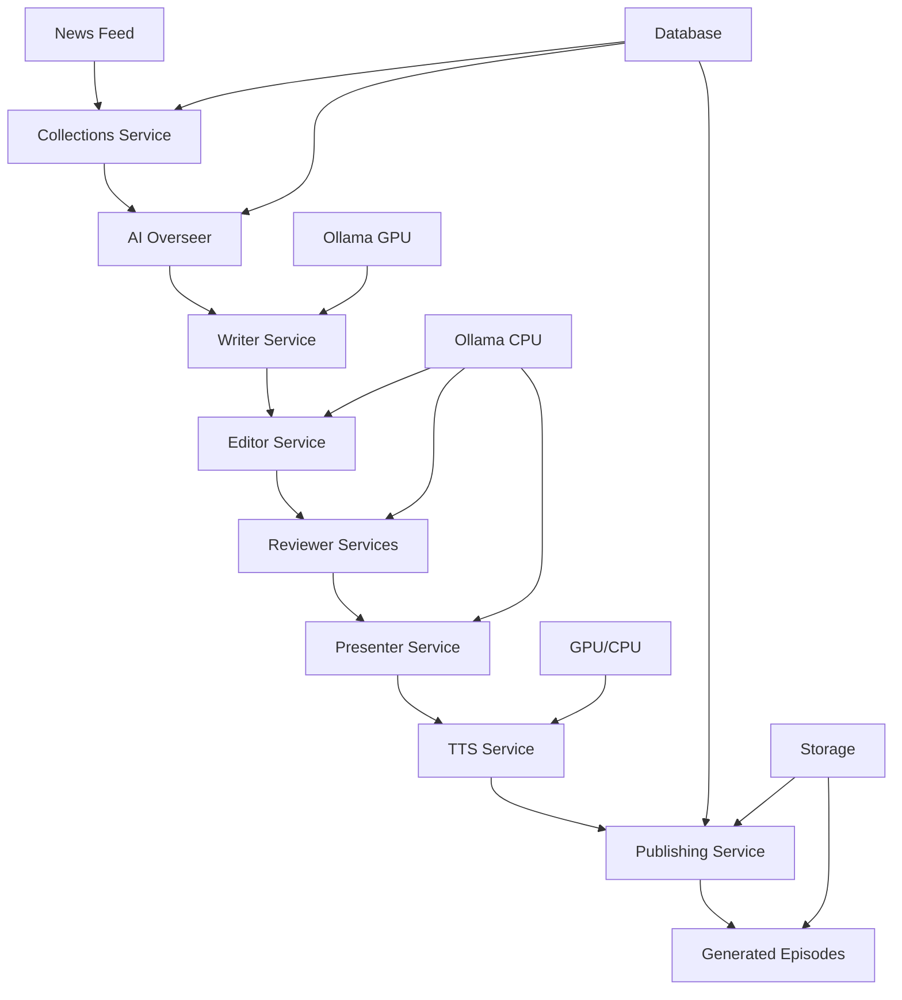

# Current System Architecture

## 🏗️ **Microservices Architecture Overview**

### **Core Services**

#### **1. AI Overseer** (`services/ai-overseer/`)
- **Port:** 8000
- **Role:** Orchestrates podcast generation workflow
- **Dependencies:** All other services
- **Key Features:**
  - Celery task management
  - Episode generation coordination
  - Collection assignment
  - Health monitoring

#### **2. API Gateway** (`services/api-gateway/`)
- **Port:** 8001
- **Role:** Web interface and API routing
- **Dependencies:** All backend services
- **Key Features:**
  - Admin dashboard
  - Collection management
  - Episode monitoring
  - User authentication

#### **3. Collections Service** (`services/collections/`)
- **Port:** 8002
- **Role:** Article collection management
- **Dependencies:** Database
- **Key Features:**
  - Collection creation and status tracking
  - Article assignment
  - Snapshot management
  - Group assignment

#### **4. Writer Service** (`services/writer/`)
- **Port:** 8003
- **Role:** Script generation using LLMs
- **Dependencies:** Ollama (GPU)
- **Key Features:**
  - Multi-speaker script generation
  - Article analysis and synthesis
  - Presenter name integration
  - Quality content creation

#### **5. Editor Service** (`services/editor/`)
- **Role:** Script review and polishing
- **Dependencies:** Ollama (CPU)
- **Key Features:**
  - Script quality improvement
  - Multi-speaker format preservation
  - Content refinement
  - Error correction

#### **6. Presenter Service** (`services/presenter/`)
- **Port:** 8013
- **Role:** Persona management and audio generation
- **Dependencies:** Ollama (CPU), TTS Service
- **Key Features:**
  - Presenter briefs and feedback
  - Audio generation coordination
  - Multi-speaker audio creation
  - Quality control

#### **7. TTS Service** (`services/tts/`)
- **Port:** 8015
- **Role:** Text-to-speech generation
- **Dependencies:** GPU (VibeVoice) or CPU (Coqui)
- **Key Features:**
  - Multi-speaker audio synthesis
  - Voice variety support
  - Audio file generation
  - Quality optimization

#### **8. Reviewer Services** (`services/reviewer/`, `services/light-reviewer/`, `services/heavy-reviewer/`)
- **Role:** Content quality assessment
- **Dependencies:** Ollama (CPU)
- **Key Features:**
  - Script quality evaluation
  - Content accuracy checking
  - Improvement suggestions
  - Multi-tier review process

#### **9. News Feed Service** (`services/news-feed/`)
- **Port:** 8004
- **Role:** RSS feed management
- **Dependencies:** Database
- **Key Features:**
  - RSS feed monitoring
  - Article ingestion
  - Content filtering
  - Update scheduling

#### **10. Publishing Service** (`services/publishing/`)
- **Port:** 8005
- **Role:** Episode publishing and distribution
- **Dependencies:** Database, Storage
- **Key Features:**
  - Episode metadata management
  - File organization
  - Publishing workflows
  - Distribution tracking

---

## 🔄 **Data Flow Architecture**

### **Podcast Generation Workflow**

### **Service Communication**

#### **HTTP APIs**
- **AI Overseer** → **Writer/Editor/Reviewer/Presenter**
- **Presenter** → **TTS Service**
- **API Gateway** → **All Services**

#### **Database Connections**
- **Collections** → PostgreSQL
- **AI Overseer** → PostgreSQL
- **Publishing** → PostgreSQL

#### **Message Queue**
- **Celery** → Redis (task queue)
- **AI Overseer** → Celery (async tasks)

---

## 🗄️ **Data Architecture**

### **Database Schema (PostgreSQL)**

#### **Core Tables**
- **`podcast_groups`** - Podcast show definitions
- **`collections`** - Article collections
- **`articles`** - Individual news articles
- **`episodes`** - Generated podcast episodes
- **`presenters`** - Host/presenter definitions
- **`generation_requests`** - Episode generation tracking

#### **Key Relationships**
- Groups → Collections (one-to-many)
- Collections → Articles (one-to-many)
- Episodes → Groups (many-to-one)
- Episodes → Collections (many-to-one)

### **Storage Architecture**

#### **File Storage**
- **`/app/storage/episodes/{episode_id}/`** - Episode audio files
- **`/app/storage/voice_samples/`** - TTS voice samples
- **`/app/storage/models/`** - AI model cache

#### **Volume Mounts**
- **`episode_storage`** - Persistent episode storage
- **`ollama_data`** - Ollama model cache
- **`ollama_cpu_data`** - CPU Ollama model cache

---

## ⚙️ **Configuration Architecture**

### **Environment Variables**

#### **Service-Specific**
- **`OLLAMA_BASE_URL`** - Ollama server endpoint
- **`OLLAMA_MODEL`** - LLM model name
- **`USE_VIBEVOICE`** - TTS backend selection
- **`TTS_BACKEND`** - TTS implementation choice

#### **System-Wide**
- **`DATABASE_URL`** - PostgreSQL connection
- **`REDIS_URL`** - Redis connection
- **`OLLAMA_KEEP_ALIVE`** - Model persistence
- **`OLLAMA_NUM_THREADS`** - CPU thread allocation

### **Docker Compose Structure**

#### **Service Definitions**
- **`services`** - Individual service configurations
- **`volumes`** - Persistent storage definitions
- **`networks`** - Inter-service communication
- **`depends_on`** - Service startup dependencies

#### **Resource Allocation**
- **GPU Services:** Writer, TTS (VibeVoice)
- **CPU Services:** Editor, Reviewer, Presenter
- **Dual Services:** AI Overseer, API Gateway

---

## 🔧 **Technology Stack**

### **Backend Technologies**
- **Python 3.11** - Primary language
- **FastAPI** - Web framework
- **Celery** - Task queue
- **PostgreSQL** - Database
- **Redis** - Cache and message broker

### **AI/ML Technologies**
- **Ollama** - LLM inference
- **Coqui XTTS v2** - Text-to-speech (current)
- **VibeVoice** - Advanced TTS (target)
- **PyTorch** - ML framework
- **Transformers** - Model loading

### **Infrastructure**
- **Docker** - Containerization
- **Docker Compose** - Orchestration
- **Nginx** - Reverse proxy
- **Prometheus** - Metrics collection
- **Grafana** - Monitoring dashboard

---

## 📊 **Monitoring Architecture**

### **Metrics Collection**
- **Prometheus** - Metrics scraping
- **Grafana** - Visualization
- **Custom metrics** - Service-specific monitoring

### **Health Checks**
- **Service endpoints** - `/health` endpoints
- **Dependency checks** - Database, Redis, Ollama
- **Resource monitoring** - CPU, RAM, GPU, VRAM

### **Logging**
- **Structured logging** - JSON format
- **Log levels** - DEBUG, INFO, WARNING, ERROR
- **Centralized collection** - Docker logs

---

## 🚀 **Deployment Architecture**

### **Current Deployment (8GB VRAM)**
- **Coqui XTTS v2** - Lightweight TTS
- **CPU/GPU split** - Resource optimization
- **Sequential processing** - Memory management

### **Target Deployment (96GB VRAM)**
- **VibeVoice** - Advanced TTS
- **Parallel processing** - Full resource utilization
- **Voice cloning** - Custom voice generation

### **Scaling Strategy**
- **Horizontal scaling** - Multiple service instances
- **Vertical scaling** - Increased resources
- **Load balancing** - Nginx distribution

---

## 🔒 **Security Architecture**

### **Authentication**
- **JWT tokens** - Service authentication
- **API keys** - External access
- **Role-based access** - Permission management

### **Network Security**
- **Internal networks** - Service isolation
- **TLS encryption** - Secure communication
- **Firewall rules** - Port restrictions

### **Data Security**
- **Encrypted storage** - Sensitive data protection
- **Access controls** - Database permissions
- **Audit logging** - Security monitoring

---

## 📈 **Performance Architecture**

### **Optimization Strategies**
- **Model caching** - Ollama keep-alive
- **Resource allocation** - CPU/GPU distribution
- **Async processing** - Celery task queue
- **Connection pooling** - Database optimization

### **Monitoring Metrics**
- **Response times** - Service performance
- **Resource usage** - CPU, RAM, GPU
- **Throughput** - Requests per second
- **Error rates** - System reliability

---

**Last Updated:** October 3, 2025  
**Architecture Version:** 2.0 (Post-VibeVoice Split)  
**Status:** Production Ready
