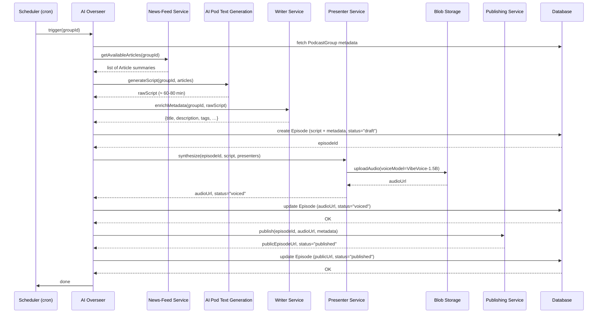

| Diagram | What it shows | How to render |
|--------|----------------|---------------|
| **Entity‑Relationship (ER) diagram** | Data model (Podcast Group, Presenter, Writer, News Feed, Episode, Article) | Paste the **Mermaid** block into a Markdown file, a VS Code Markdown preview, GitHub, GitLab, Notion, etc. |
| **Sequence diagram (episode‑generation flow)** | Runtime interaction from schedule trigger to publishing | Same – paste the Mermaid block into any Markdown‑aware viewer. |
| **High‑level architecture diagram** | Service boundaries and communication paths | Use the Mermaid **flowchart** block (or PlantUML if you prefer). |

---

## 1️⃣ Entity‑Relationship Diagram (Mermaid)

```mermaid
erDiagram
    PODCAST_GROUP ||--|{ PODCAST_GROUP_PRESENTER : "has"
    PODCAST_GROUP ||--|{ EPISODE : "produces"
    PODCAST_GROUP ||--|| WRITER : "uses"
    PODCAST_GROUP ||--|{ NEWS_FEED_ASSIGNMENT : "assigned to"
    PODCAST_GROUP }|..|{ NEWS_FEED : "consumes"

    PODCAST_GROUP_PRESENTER }|..|{ PRESENTER : "references"
    EPISODE }|..|{ EPISODE_METADATA : "stores"
    EPISODE }|..|{ AUDIO_FILE : "produces"
    EPISODE }|..|{ EPISODE_ARTICLE_LINK : "links"
    EPISODE_ARTICLE_LINK }|..|{ ARTICLE : "references"

    NEWS_FEED ||--|{ ARTICLE : "contains"

    %% Attributes
    PODCAST_GROUP {
        uuid id PK
        string name
        text description
        string category
        string subcategory
        string language
        string country
        string[] tags
        string[] keywords
        string schedule   // cron‑like
        enum status
    }
    PRESENTER {
        uuid id PK
        string name
        text bio
        int age
        string gender
        json demographics
        json biases
        string[] specialties
        string[] expertise
        string[] interests
        string country
        string city
    }
    WRITER {
        uuid id PK
        string model   // fixed=Ollama
    }
    NEWS_FEED {
        uuid id PK
        string source_url
        enum type  // RSS or MCP
        datetime last_fetched
    }
    ARTICLE {
        uuid id PK
        string title
        string link
        text summary
        datetime publish_date
    }
    EPISODE {
        uuid id PK
        uuid group_id FK
        text script
        datetime created_at
        enum status   // draft, voiced, published
    }
    EPISODE_METADATA {
        uuid episode_id PK,F K
        string title
        text description
        string[] tags
        string[] keywords
        string category
        string subcategory
        string language
        string country
    }
    AUDIO_FILE {
        uuid episode_id PK,F K
        string url   // blob storage location
        int duration_seconds
    }
    PODCAST_GROUP_PRESENTER {
        uuid group_id PK,F K
        uuid presenter_id PK,F K
        int order   // 1‑4
    }
    PODCAST_GROUP_PRESENTER_ASSIGNMENT {
        uuid group_id PK,F K
        uuid presenter_id PK,F K
    }
    NEWS_FEED_ASSIGNMENT {
        uuid group_id PK,F K
        uuid feed_id PK,F K
    }
    EPISODE_ARTICLE_LINK {
        uuid episode_id PK,F K
        uuid article_id PK,F K
    }
```

**How to see it:**  
1. Copy the block (including the three back‑ticks).  
2. Paste into any Markdown file that supports Mermaid (e.g., GitHub `.md`, VS Code with the *Markdown Preview Mermaid* extension, Notion, Obsidian, etc.).  
3. The diagram will render automatically.

---

## 2️⃣ Sequence Diagram – “Generate a Podcast Episode”



**Explanation of steps**

| Step | Actor(s) | Action |
|------|----------|--------|
| 1 |Scheduler → Overseer| Cron fires for a specific Podcast Group.|
| 2 |Overseer ↔ FeedSvc| Pull the most recent, topic‑relevant articles that match the group’s bias/keywords.|
| 3 |Overseer → TextGen| Feed the article summaries into the Ollama model to produce a ~60‑80 min raw script.|
| 4 |Overseer → Writer| Ask the Writer (same Ollama instance) to generate title, description, tags, categories, etc.|
| 5 |Overseer → DB| Store the episode record as *draft*.|
| 6 |Overseer → Presenter| Run the VibeVoice‑1.5B TTS model for each assigned presenter (order 1‑4).|
| 7 |Presenter → Storage| Upload the resulting .wav/.mp3 to blob storage; return a URL.|
| 8 |Overseer → Publisher| Call the external podcast‑hosting API (e.g., Anchor) with audio URL and metadata.|
| 9 |Overseer → DB| Mark the episode as *published* and store the public URL.|
| 10 |Overseer → Scheduler| Signal completion (for monitoring/metrics).|

---

## 3️⃣ High‑Level Architecture / Service Flow (Mermaid Flowchart)

```mermaid
flowchart TD
    subgraph ClientSide[ ]
        UI[Web / Admin UI] -->|REST / GraphQL| API[API Gateway]
    end

    subgraph Services
        News[News‑Feed Service] --> Overseer
        Text[AI Pod Text Generation] --> Overseer
        Writer[Writer Service] --> Overseer
        Presenter[Presenter Service] --> Overseer
        Publish[Publishing Service] --> Overseer
    end

    Overseer --> DB[(Database)]
    Presenter --> VoiceModel[VibeVoice‑1.5B<br/>(HF)]
    Text & Writer --> Ollama[Ollama Model<br/>(local)]
    Publish --> External[Podcast Hosting<br/>APIs]

    API --> Overseer
    UI -->|Add / Edit| DB
    UI -->|View status| DB

    classDef infra fill:#f9f,stroke:#333,stroke-width:1px;
    class DB,VoiceModel,Ollama infra;
```

**Key points**

* **API Gateway** – single entry point for admin UI, external triggers, and health‑checks.  
* **Database** – relational store (PostgreSQL) holding all entities from the ER diagram.  
* **Blob storage** – not shown explicitly but used by **Presenter** to persist audio files.  
* **Ollama** – runs locally on the same host as **Text** and **Writer** (shared GPU/CPU).  
* **VibeVoice‑1.5B** – pulled from Hugging Face; executed by the **Presenter** service.  
* **External** – any number of podcast‑hosting platforms (Anchor, Libsyn, etc.) reachable via OAuth‑protected APIs.

---

## 📦 How to generate the diagrams yourself

| Tool | Steps |
|------|-------|
| **VS Code** (Markdown preview) | 1. Install *Markdown All in One* + *Markdown Preview Mermaid*. 2. Open a `.md` file, paste a diagram block, open the preview (`Ctrl+K V`). |
| **GitHub / GitLab** | Create a `.md` file in a repo, push it, and view it directly on the web UI – both render Mermaid automatically. |
| **Obsidian** | Enable the built‑in Mermaid plugin, paste the block into a note, toggle preview mode. |
| **PlantUML** (optional) | Convert the Mermaid syntax to PlantUML if you prefer that engine – the structures are identical; just replace the syntax header (`@startuml … @enduml`). |
| **Online** | Use <https://mermaid.live/> – paste any block and hit *Render*. You can export PNG/SVG from there. |

---

### Next steps you might ask the LLM to do

1. **Generate the full OpenAPI spec** for each service (based on the ER diagram).  
2. **Write concrete prompt templates** for the Ollama model (script generation, metadata extraction).  
3. **Produce Docker‑Compose / Kubernetes manifests** for the micro‑service deployment.  
4. **Create unit‑test stubs** for each endpoint using the OpenAPI definitions.  

Just let me know which artifact you’d like to dive into next!